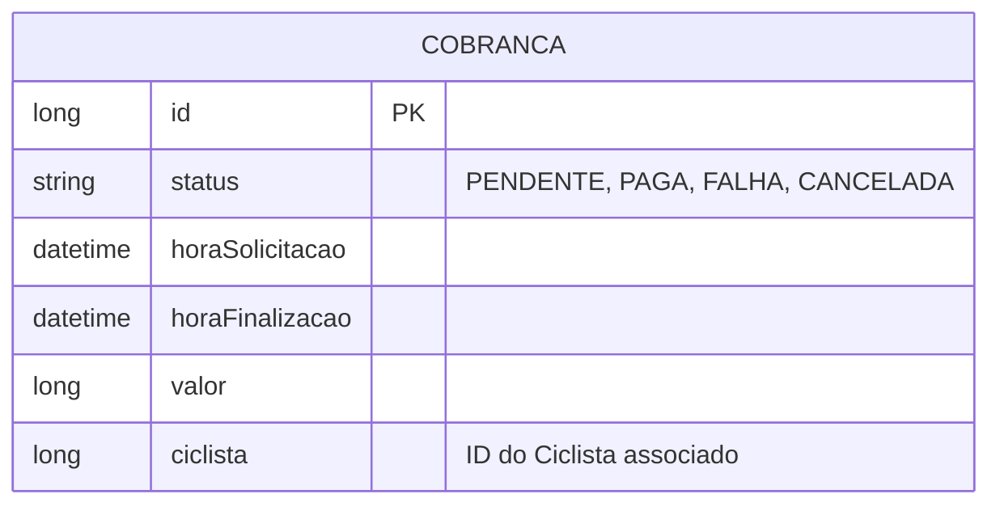

# API Externo - Sistema de Controle de Bicicletário

API REST do **Módulo Externo**, microsserviço parte do Sistema de Controle de Bicicletário. Ela centraliza as integrações com serviços de terceiros, sendo responsável pelo processamento de pagamentos via **Stripe**, envio de notificações por **e-mail** e gerenciamento de **filas de cobrança** dos ciclistas.


---

## Sumário

- [Visão geral](#visão-geral)
- [Stack](#stack)
- [Arquitetura](#arquitetura)
- [Modelo de domínio](#modelo-de-domínio)
- [Processamento de Cobranças (Stripe)](#processamento-de-cobranças-stripe)
- [Pré-requisitos](#pré-requisitos)
- [Configuração](#configuração)
- [Como executar](#como-executar)
- [Testes e qualidade](#testes-e-qualidade)
- [Referência da API](#referência-da-api)
- [Padrão de respostas e erros](#padrão-de-respostas-e-erros)

---

## Visão geral

O que a API faz hoje:

- **Integração com Stripe:** Validação de cartões de crédito e processamento de pagamentos (cobranças) utilizando tokens associados aos cartões.
- **Integração de E-mail:** Envio de notificações e comunicados aos usuários utilizando SMTP do Google.
- **Fila de Cobranças:** Armazenamento e reprocessamento assíncrono de cobranças que não puderam ser debitadas imediatamente (status `PENDENTE`).
- **Comunicação entre Microsserviços:** Resgate de informações sensíveis do usuário (como token de cartão) comunicando-se com o microsserviço de aluguel (`url.aluguel`).

---

## Stack

| Camada | Tecnologia |
|---|---|
| Linguagem | Java (17 ou superior) |
| Framework | Spring Boot (Web, Data JPA, Validation, Mail) |
| Banco de dados | H2 Database (em memória para dev/test) / PostgreSQL (pronto para prod) |
| Integrações | Stripe API (Pagamentos), JavaMailSender (E-mails) |
| Produtividade | Lombok |
| Testes | JUnit 5, Mockito, MockWebServer |
| Documentação/Logging| SLF4J / Logback |

---

## Arquitetura

Aplicação baseada em microsserviços, estruturada em camadas tradicionais:

```
Controller  →  Service (interface + implementação)  →  Repository  →  Banco de Dados (H2)
    │                      │
    └── DTOs (records)     └── Integrações Externas (Stripe / Servidor SMTP / MS Aluguel)
```

- **Controller**: Expõe os endpoints REST e valida os *payloads* de entrada usando anotações como `@Valid`.
- **Service**: Implementa a regra de negócio. Contém as interfaces (ex: `CobrancaServiceInterface`) para desacoplamento e facilidade de testes.
- **Repository**: Interfaces do Spring Data JPA.
- **DTO**: Objetos de transferência de dados (ex: `NovaCobranca`, `NovoEmail`, `NovoCartaoDeCredito`).
- **Exception**: Controle de exceções unificado via `ControllerAdvice` para devolução padronizada de erros.

---

## Modelo de domínio



### Entidades

| Entidade | Tabela | Descrição |
|---|---|---|
| `CobrancaEntity` | `cobranca` | Armazena o registro financeiro de uma tentativa de cobrança, contendo valor, data de solicitação/finalização e o ID do ciclista. |

O modelo de **Cartão de Crédito** e **E-mail** não são persistidos neste banco de dados, servindo apenas como trânsito de dados (DTOs) repassados às APIs do Stripe e SMTP, garantindo segurança (não armazenamos CVV ou dados brutos permanentemente).

---

## Processamento de Cobranças (Stripe)

A API possui uma mecânica flexível para pagamentos:

1. **Validação de Cartão:** O endpoint `/validaCartaoDeCredito` recebe os dados do cartão, cria uma intenção de pagamento no Stripe (`PaymentIntent`) e, se aprovada, a cancela imediatamente. Isso garante que o cartão é válido sem cobrar o usuário.
2. **Nova Cobrança Direta:** Ao solicitar uma cobrança (`POST /cobranca`), a API faz uma chamada REST ao microsserviço de Aluguel (`/cartaoDeCredito/{id}`) para recuperar o token do ciclista. Após recuperar, aciona o Stripe para capturar o valor (`captureMethod = MANUAL`).
3. **Fila de Cobranças:** Quando ocorre um problema pontual de rede ou de fundos temporários, a cobrança pode ser enfileirada (`POST /filaCobranca`), ficando como `PENDENTE`.
4. **Processamento em Lote:** O endpoint `/processaCobrancasEmFila` varre o banco buscando cobranças `PENDENTE` e tenta debitá-las no Stripe via processamento paralelo (`parallelStream()`).

---

## Pré-requisitos

- **JDK 17+**
- **Maven** ou **Gradle**
- **Credenciais do Stripe:** Chave de API secreta (Secret Key).
- **Conta de E-mail (SMTP):** Conta Gmail com "App Passwords" habilitado para envio de notificações.

---

## Configuração

O sistema utiliza o `application.properties` para definir parâmetros essenciais de ambiente. 

### Variáveis de ambiente e Propriedades

| Propriedade | Descrição |
|---|---|
| `spring.mail.username` | E-mail remetente (ex: `bicicletarioemail@gmail.com`) |
| `spring.mail.password` | Senha de aplicativo do Google (App Password) |
| `stripe.api.key` | Chave secreta da API do Stripe |
| `url.aluguel` | URL base do microsserviço de aluguéis (ex: `http://localhost:8082`) |

> **Nota para Produção:** O banco de dados padrão está configurado como H2 (em memória). Para alterar para PostgreSQL, basta descomentar as propriedades correspondentes em `application.properties` e definir `spring.jpa.hibernate.ddl-auto=update`.

---

## Como executar

```bash
# 1. Clonar o repositório
git clone https://github.com/SeuUsuario/api-externo-bicicletario.git
cd api-externo-bicicletario

# 2. Configurar as variáveis de ambiente necessárias
export STRIPE_API_KEY="sk_test_sua_chave_aqui"
export URL_ALUGUEL="http://localhost:8082"

# 3. Executar o projeto (exemplo com Maven)
./mvnw spring-boot:run
```

A aplicação subirá na porta padrão `8080` (a menos que sobrescrita). O console do banco de dados em memória pode ser acessado em `http://localhost:8080/h2-console`.

---

## Testes e qualidade

O projeto conta com uma robusta suíte de testes de unidade e de integração, isolando chamadas de rede externas usando o **MockWebServer** da OkHttp e a biblioteca **Mockito**.

```bash
# Rodar todos os testes
./mvnw test
```

- A classe `TestsIntegracao` sobe um mock server na porta configurada dinamicamente, garantindo que testes de comunicação com o MS de Aluguéis e envio de e-mails ocorram sem depender de recursos vivos.
- Há cobertura específica para cenários de rejeição de cartões (fundos insuficientes, cartão roubado, expirado) mapeados pela API do Stripe na classe genérica `CartaoInvalidoException`.

---

## Referência da API

### Banco de Dados (Admin)

| Método | Rota | Descrição |
|---|---|---|
| `GET` | `/restaurarBanco` | Limpa todos os dados da tabela de cobranças (útil para reset de testes). |

### E-mail

| Método | Rota | Descrição |
|---|---|---|
| `POST` | `/enviarEmail` | Envia um e-mail. Requer `email`, `assunto` e `mensagem` no payload. |

### Cartão de Crédito e Cobranças

| Método | Rota | Descrição |
|---|---|---|
| `POST` | `/validaCartaoDeCredito` | Valida um novo cartão de crédito junto ao Stripe. |
| `POST` | `/filaCobranca` | Cria e adiciona uma cobrança com status `PENDENTE` na fila. |
| `POST` | `/cobranca` | Tenta efetuar a cobrança de um ciclista imediatamente. |
| `POST` | `/processaCobrancasEmFila`| Tenta reprocessar todas as cobranças pendentes na fila. |
| `GET`  | `/cobranca/{id}` | Retorna os detalhes de uma cobrança específica. |

Exemplo de payload - Nova Cobrança (`POST /cobranca`):
```json
{
  "valor": 100,
  "ciclista": 1
}
```

---

## Padrão de respostas e erros

Os erros da API são capturados e tratados globalmente pelo `ControllerAdvice`. Todas as falhas seguem um modelo padronizado:

```json
{
  "codigo": "422",
  "mensagem": "Erro de validação de cartão: Fundos insuficientes"
}
```

| Situação | HTTP | Observação |
|---|---|---|
| Sucesso | `200` / `201` | Corpo da resposta de acordo com o DTO esperado. |
| Validação de campos (`@Valid`) | `422` (Unprocessable Entity) | Devolve array informando quais campos violaram as regras. |
| Cartão inválido ou falha no Stripe | `422` | Trata retornos como `insufficient_funds`, `lost_card`, `expired_card`, etc. |
| E-mail não enviado ou erro de API | `500` | Erro interno tratado, impedindo vazamento de stacktrace. |
| Recurso não encontrado | `404` | Ex: E-mail inexistente ou ID de cobrança inválido. |
